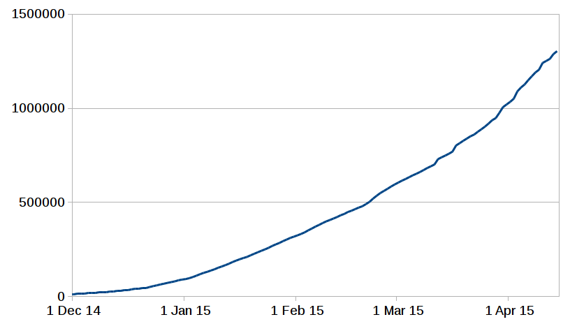

% Rust Sydney #2

code of conduct: <a href="http://www.rust-lang.org/conduct.html">rust-lang.org/conduct.html</a>

# Welcome

Thanks:

- Palantir Technologies
- Robert Fink
- Toby Hede

# In case you missed it

Rust 1.0.0 is close!

The beta was released on April 3. The beta is the first time we're
aiming for stability, and first time the staging restrictions are
on. Full release on May 15.

crates.io passed 1 million downloads on March 30.

# Planned upcoming events

- Hack-night in ~2 weeks (end of April): start a project; bring a project; learn Rust.
- 1.0.0 release meet-up/party around May 15
- Another hack-night at the end of May
- Meet-up in early-mid June

# Tonight

- Toby Hede: an Introduction to Macros
- Robert Fink: Ownership
- Huon Wilson: tRustworthy concurrency
